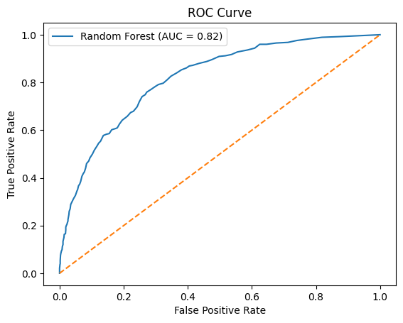

# Telecommunication Customer Churn Prediction ML

## MSc Dissertation Project

An Interpretable Machine Learning Framework for Customer Segmentation and Churn Prediction in Telecommunications Services.

## Project Overview

This project develops machine learning models to predict customer churn and identify key customer segments in the telecommunications industry.

## Model Performance

### Accuracy Comparison

| Model | Accuracy |
|---------|---------|
| Logistic Regression | 78.68% |
| Random Forest | 79.25% |
| XGBoost | 77.33% |

**Best Performing Model:** Random Forest (79.25%)

## Algorithms Used

- Logistic Regression
- Random Forest
- XGBoost
- K-Means Clustering

## Technologies

- Python
- Pandas
- NumPy
- Scikit-learn
- XGBoost
- Matplotlib
- Seaborn
- Google Colab

## Skills Demonstrated

  ## Project Visualizations

### Exploratory Data Analysis

### Feature Importance

### Confusion Matrix

### ROC Curve

## Author

Arun Kumar Kaliyaperumal

MSc Big Data and Data Science Technology with Advanced Practice

Northumbria University, 
